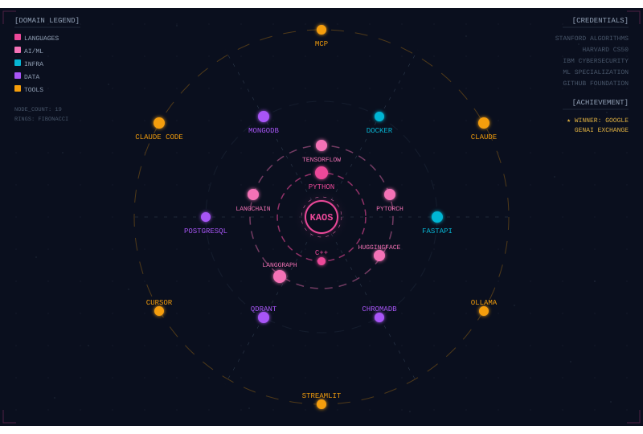

  
   
  
  
  
  

 

<!-- Version texte brut — toujours visible même sans rendu des SVG -->

  <strong>Theprogrammer-X007</strong> 
  <strong>Data Scientist et Ingénieur ML</strong> · pipelines de données, deep learning et compétitions ML 
  Zindi · MLOps · deep learning · systèmes ML de bout en bout 
  Informatique · Université de Douala 
  <em>Candidat à la bourse MEXT 2027 (Japon)</em> 

 

  

  

 

  

  

 

  

  

 

  

  
   
  
   
  
   
  
   
  
   
  
    
  

 

  

### // Ma philosophie de construction

Un modèle qui performe bien en notebook et casse en production n'a rien résolu. Je construis pour la tenue dans le temps : des pipelines qui gèrent les données manquantes et les dérives sans s'effondrer, du code documenté qu'une autre personne peut reprendre, des déploiements qui ne surprennent personne à 3h du matin.

L'essentiel de mon travail se situe à l'intersection de données réelles imparfaites et de modèles qui doivent généraliser — des rendements agricoles sur des régions jamais vues, des prévisions de stockage d'eau à plusieurs mois, des risques de mortalité entre districts aux profils très différents. Ce qui m'intéresse, ce n'est pas de gagner 0,1% de plus sur un benchmark propre, c'est de faire en sorte qu'un modèle se comporte correctement quand les données cessent de coopérer.

| Si c'est une **compétition** | Le score au classement compte, mais le pipeline que je peux expliquer à un jury compte plus encore. Encodage hiérarchique, validation temporelle rigoureuse, aucune fuite de données — cette rigueur discrète est ce qui sépare une soumission chanceuse d'une méthode reproductible. |
| :--- | :--- |
| Si c'est un **pipeline de données** | Il doit survivre au contact des données réelles : valeurs manquantes, dérive de schéma, échelle jamais testée. Kafka, Spark, dbt, Airflow — des outils qui restent discrets pour que le modèle en amont n'ait pas à compenser des données de mauvaise qualité. |
| Si c'est un **modèle de deep learning** | Je veux voir ce que fait réellement chaque couche — Grad-CAM, pondération des classes, choix d'augmentation que je peux justifier, pas juste un score final que je ne saurais pas expliquer. |
| Si c'est un **déploiement embarqué** | Il doit tourner sur l'appareil pour lequel il a été conçu. PyTorch → ONNX → TFLite n'est pas une formalité ; rendre un modèle assez petit et rapide pour un téléphone sur le terrain, c'est la moitié du travail d'ingénierie. |

La contrainte à laquelle je reviens toujours : **un modèle qui performe isolément mais ne généralise pas ne m'a rien appris. Un pipeline imparfait mais rigoureusement validé, qui tient sur plusieurs régions, vaut plus qu'un pipeline propre qui ne tient pas.**

---

### ∞ Le problème de la curiosité perpétuelle

J'ai un syndrome. Ça commence par une question : *pourquoi ce pipeline casse-t-il sur cette région précise et pas les autres ?* Trois heures plus tard, je lis sur l'autocorrélation spatiale en me demandant si ça explique l'écart. (En général, oui.)

Quelques terriers de lapin dans lesquels je suis vraiment descendu : pourquoi l'encodage bayésien hiérarchique généralise mieux que l'encodage cible plat sur de petits jeux de données régionaux · si les signaux hydrologiques satellitaires (GRACE) corrèlent vraiment proprement avec les indicateurs de sécheresse sur le terrain · ce qui rend un split de validation "honnête dans le temps" plutôt qu'une fuite discrète du futur · jusqu'où un modèle entraîné sur les données agricoles d'un pays peut voyager vers un autre.

 

  

### Télémétrie système

  <table border="0" cellpadding="0" cellspacing="0">
    <tr>
      <td align="center">
        
      </td>
      <td align="center">
        
      </td>
    </tr>
    <tr>
      <td colspan="2" align="center">
         
        
      </td>
    </tr>
  </table>

 

  <picture>
    <source media="(prefers-color-scheme: dark)" srcset="https://raw.githubusercontent.com/Theprogrammer-X007/Theprogrammer-X007/output/snake.svg?palette=github-dark">
    <source media="(prefers-color-scheme: light)" srcset="https://raw.githubusercontent.com/Theprogrammer-X007/Theprogrammer-X007/output/snake.svg">
    
  </picture>

 

  

